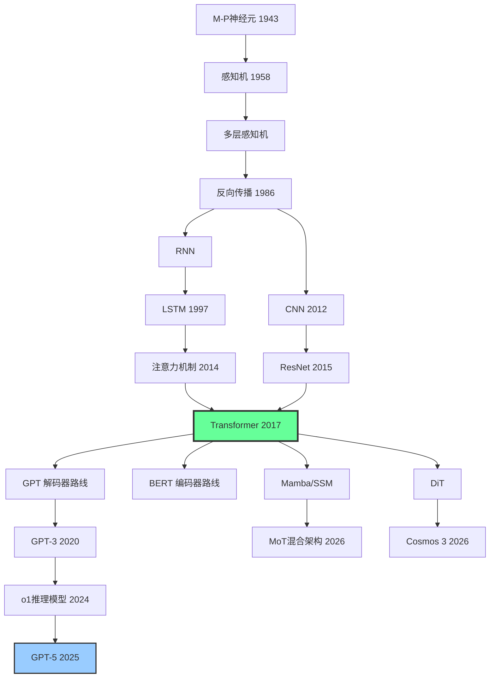

# 神经网络架构演进图

```mermaid
graph TD
    MP[M-P神经元 1943] --> P[感知机 1958]
    P --> MLP[多层感知机]
    MLP --> BP[反向传播 1986]
    BP --> RNN[RNN]
    BP --> CNN[CNN 2012]
    RNN --> LSTM[LSTM 1997]
    LSTM --> Attn[注意力机制 2014]
    CNN --> ResNet[ResNet 2015]
    Attn --> Trans[Transformer 2017]
    ResNet --> Trans
    Trans --> GPT[GPT 解码器路线]
    Trans --> BERT[BERT 编码器路线]
    GPT --> GPT3[GPT-3 2020]
    GPT3 --> o1[o1推理模型 2024]
    o1 --> GPT5[GPT-5 2025]
    Trans --> DiT[DiT]
    Trans --> SSM[Mamba/SSM]
    SSM --> MoT[MoT混合架构 2026]
    DiT --> Cosmos3[Cosmos 3 2026]
    style Trans fill:#6f9,stroke:#333,stroke-width:3px
    style GPT5 fill:#9cf,stroke:#333,stroke-width:2px
```
