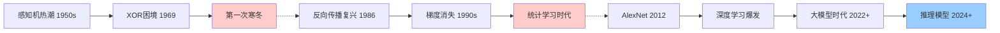

# AI的三次浪潮

```mermaid
graph LR
    A1[感知机热潮 1950s] --> A2[XOR困境 1969] --> A3[第一次寒冬]
    A3 -.-> B1[反向传播复兴 1986]
    B1 --> B2[梯度消失 1990s] --> B3[统计学习时代]
    B3 -.-> C1[AlexNet 2012]
    C1 --> C2[深度学习爆发] --> C3[大模型时代 2022+] --> C4[推理模型 2024+]
    style A3 fill:#fcc
    style B3 fill:#fcc
    style C4 fill:#9cf
```
