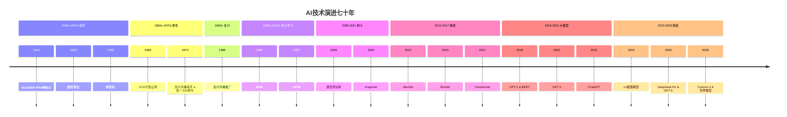

# AI技术演进时间线

```mermaid
timeline
    title AI技术演进七十年
    section 1940s-1950s 萌芽
        1943 : McCulloch-Pitts神经元
        1950 : 图灵测试
        1958 : 感知机
    section 1960s-1970s 寒冬
        1969 : XOR问题证明
        1974 : 反向传播萌芽 & 第一次AI寒冬
    section 1980s 复兴
        1986 : 反向传播推广
    section 1990s-2000s 统计学习
        1995 : SVM
        1997 : LSTM
    section 2006-2011 种子
        2006 : 逐层预训练
        2009 : ImageNet
    section 2012-2017 爆发
        2012 : AlexNet
        2015 : ResNet
        2017 : Transformer
    section 2018-2022 大模型
        2018 : GPT-1 & BERT
        2020 : GPT-3
        2022 : ChatGPT
    section 2023-2026 最新
        2024 : o1推理模型
        2025 : DeepSeek-R1 & GPT-5
        2026 : Cosmos 3 & 世界模型
```
