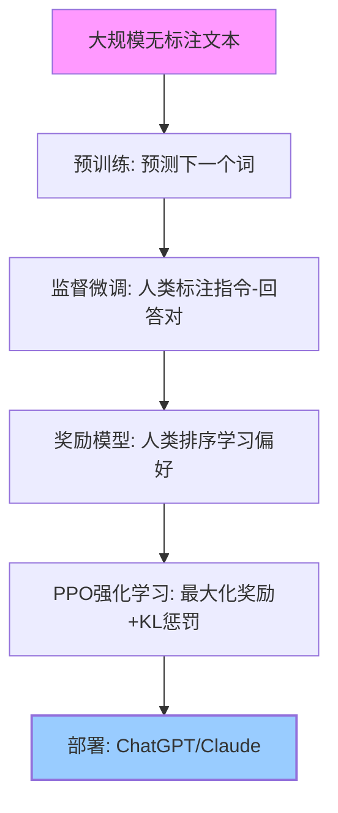

# 大语言模型训练流水线

```mermaid
graph TD
    Data[大规模无标注文本] --> Pretrain[预训练: 预测下一个词]
    Pretrain --> SFT[监督微调: 人类标注指令-回答对]
    SFT --> RM[奖励模型: 人类排序学习偏好]
    RM --> RL[PPO强化学习: 最大化奖励+KL惩罚]
    RL --> Deploy[部署: ChatGPT/Claude]
    style Data fill:#f9f
    style Deploy fill:#9cf,stroke-width:2px
```
