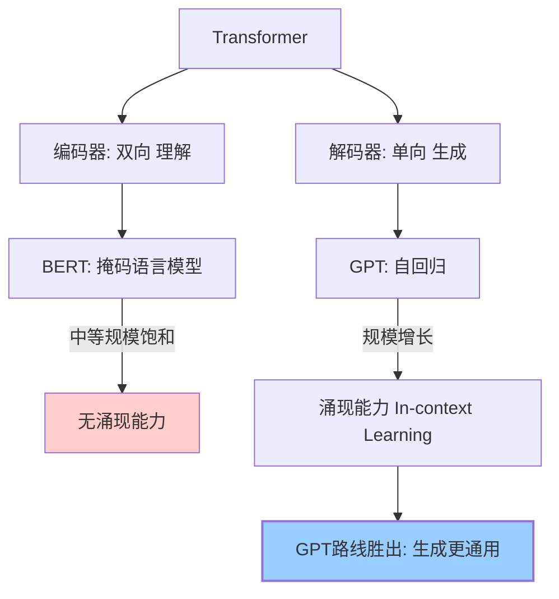

# BERT路线 vs GPT路线

```mermaid
graph TD
    Transformer --> Encoder[编码器: 双向 理解]
    Transformer --> Decoder[解码器: 单向 生成]
    Encoder --> BERT[BERT: 掩码语言模型]
    Decoder --> GPT[GPT: 自回归]
    BERT -->|中等规模饱和| Sat[无涌现能力]
    GPT -->|规模增长| Em[涌现能力 In-context Learning]
    Em --> Win[GPT路线胜出: 生成更通用]
    style Win fill:#9cf,stroke-width:2px
    style Sat fill:#fcc
```
